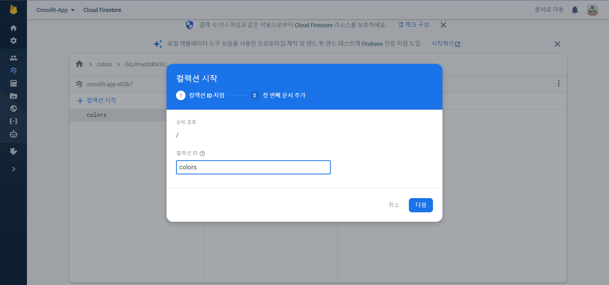
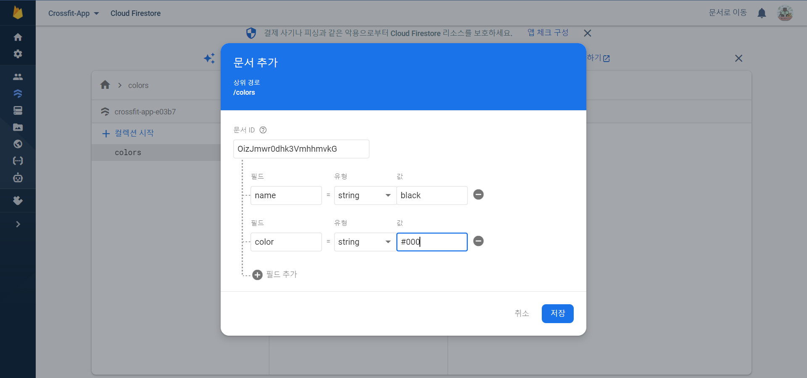
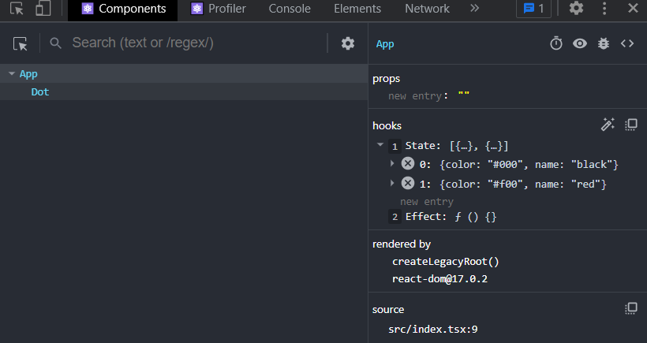

# React + TS + firebase(firestore)

## React + TS 

```
npx create-react-app my-app --template typescript react-firebase
```

## firebase

```
npm install firebase
```

## .env 파일 작성
- firebase 에서 받은 키값이 노출되지 않게 env 파일에 작성해준다.

```
  REACT_APP_API_KEY= '키값...'
  REACT_APP_AUTH_DOMAIN= 
  REACT_APP_DATABASE_URL= 
  REACT_APP_PROJECT_ID= 
  REACT_APP_STORAGE_BUCKET= 
  REACT_APP_MESSAGING_SENDER_ID= 
  REACT_APP_APP_ID= 
```

## .gitignore 에 .env 추가
- 키값이 들어있으므로 push 되지 않도록 추가해준다.

```
#API
.env
```

## firebase console 에서 collection 생성 및 doc 생성
- 기본 데이터를 생성
- `collection` : 테이블과 유사한 개념
- `doc`: 튜플 = 행과 유사한 개념.
- `doc` 하위에 필드 = 속성(열)과 유사한 개념 name, color doc 두개를 추가한다.
- `doc` 하위에는 필드 뿐만 아니라 다시 `collection` 을 추가하고 `doc` 를 추가해 나갈 수 있다.





## firebase.ts 작성

```ts
import { initializeApp } from "firebase/app";
import { getFirestore } from 'firebase/firestore'; // 추가

const firebaseConfig = {
  apiKey: process.env.REACT_APP_API_KEY,
  authDomain: process.env.REACT_APP_AUTH_DOMAIN,
  databaseURL: process.env.REACT_APP_DATABASE_URL,
  projectId: process.env.REACT_APP_PROJECT_ID,
  storageBucket: process.env.REACT_APP_STORAGE_BUCKET,
  messagingSenderId: process.env.REACT_APP_MESSAGING_SENDER_ID,
  appId: process.env.REACT_APP_APP_ID,
};

const app = initializeApp(firebaseConfig);
export default getFirestore(); // 추가
```

## App.tsx 에서 import

```tsx
// App.tsx
import db from './firebase';
```

## useEffect 로 doc 불러오기
- `collection( )`: firebase 에 만들어둔 `colors` collection 을 가져온다.
- `onSnapshot( )`: 해당 collection 을 snapshot 객체로 두번째 콜백함수로 가져온다.
- 그중에서 배열 형태인 docs 로 만들어둔 doc 에 접근 할 수 있다.
- `data()`: 저장된 데이터를 가져 올 수 있다.

```tsx
// App.tsx
function App() {
  
  // 추가
  useEffect(() => {
    onSnapshot(collection(db, "colors"), (snapshot) => {
      console.log(snapshot.docs.map((doc) => doc.data()));
    });
  }, []);

}
```

```ts
// docs 에서 하나씩 data() 를 호출해 배열로 만들어서 확인
[{color: '#000', name: 'black'}, {color: '#f00', name: 'red'}]
```

## useState 로 데이터 저장
- `Color` interface 를 추가해준다.
- `useState` 로 `Color` 배열행태로 만들어 준다.
- setColors 에서 `as Colors[]` 를 이용해 저장해준다.

```tsx
// App.tsx
interface Colors {
  name: string;
  color: string;
}

function App() {
  const [colors, setColors] = useState<Colors[]>();

  useEffect(() => {
    onSnapshot(collection(db, "colors"), (snapshot) => {
      setColors(snapshot.docs.map((doc) => doc.data()) as Colors[]);
    });
  }, []);

}
```



## 컴포넌트 키값 설정
- 가져 온 데이터를 이용해서 색상 ui를 컴포넌트화 시키자.
- 컴포넌트 key 이 필요하므로 `doc.id` 를 이용하면 `doc`의 id 값을 가져올수 있다.
- 이것을 key으로 사용하기 위해서 객체에 id 값을 추가하자.


```tsx
interface Colors {
  id: string;
  name: string;
  color: string;
}
```

```tsx
snapshot.docs.map((doc) => ({ id: doc.id, ...doc.data() })) as Colors[]
```

```tsx
const Color = ({ name, color }: Colors) => {
  return (
    <li>
      <button>edit</button>
      <Dot color={color} />
      <span>{name}</span>
      <button>del</button>
    </li>
  );
};
```

```tsx
      <ul>
        {colors?.map((color) => (
          <Color key={color.id} {...color} />
        ))}
      </ul>
```